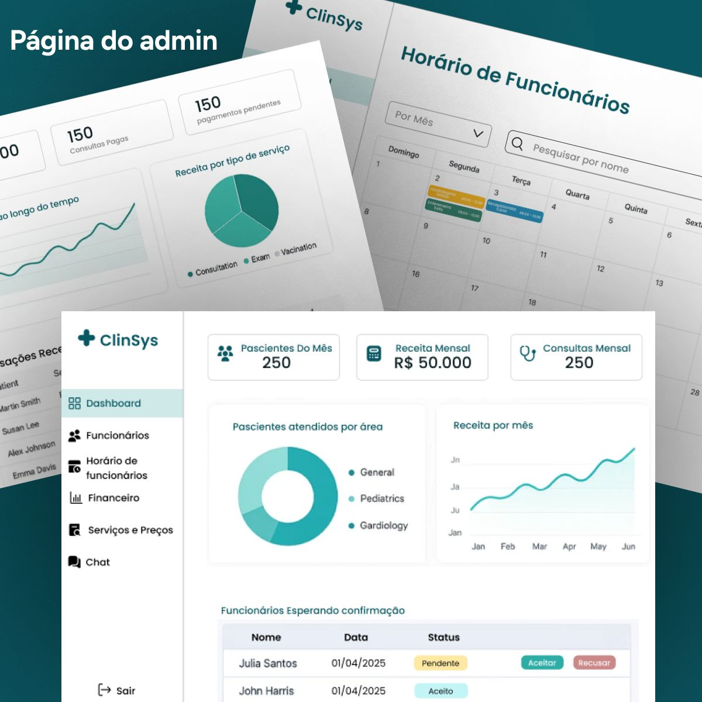

# ClinSys – Sistema Inteligente para Clínicas Médicas 🏥

O **ClinSys** é um sistema completo e inteligente para gestão de clínicas médicas. O projeto tem como objetivo oferecer uma solução moderna, intuitiva e segura para profissionais da saúde e pacientes, facilitando o controle de agendamentos, prontuários, prescrições, acesso por diferentes tipos de usuários e muito mais.

Este repositório corresponde ao **backend** da aplicação, responsável por toda a lógica de negócios, autenticação, controle de permissões e persistência de dados.

> ⚠️ **Este projeto está em desenvolvimento** e receberá novas funcionalidades em breve. Também será integrado a um **frontend** moderno e responsivo, que ainda vai ser desenvolvido.

Mais detalhes e instruções serão adicionados neste README conforme o desenvolvimento avança.

  
# imagens do projeto:

  

  

